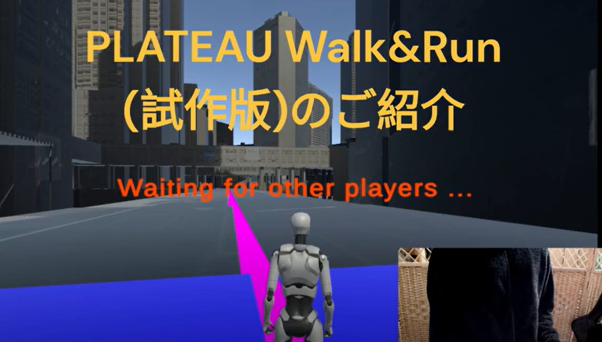
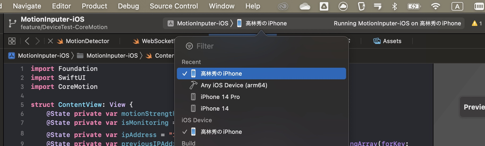
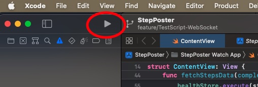
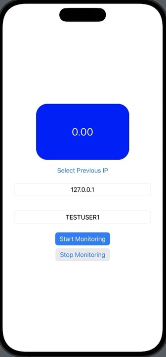
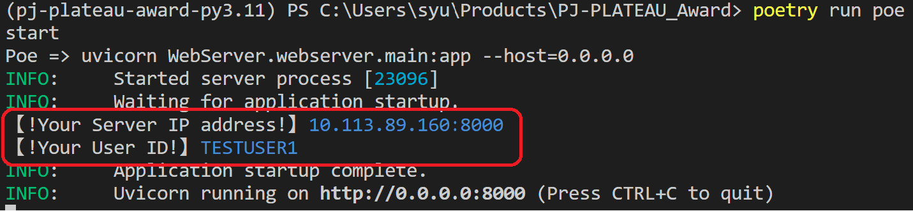
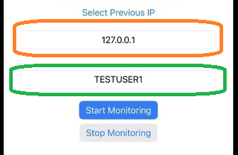
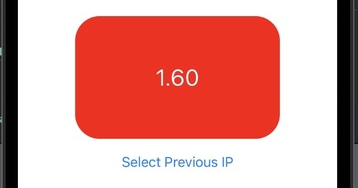
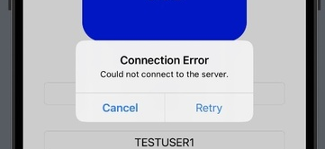
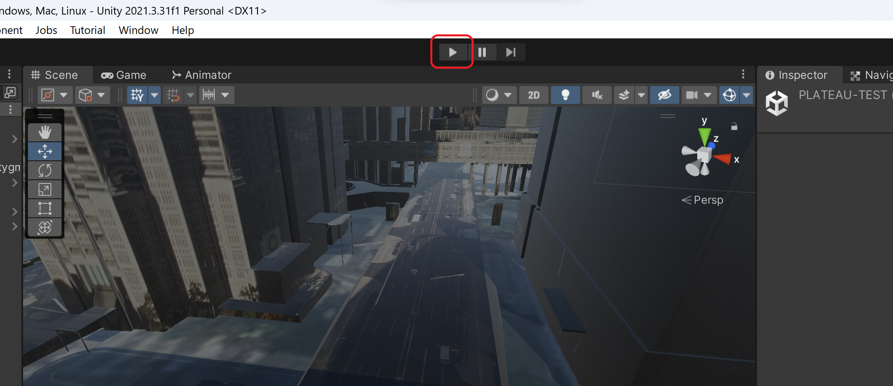

# PLATEAU Walk & Run（試験版）
[](https://www.youtube.com/watch?v=BPK70Fz0FJ0)
# 開発環境
本プロジェクトは以下の開発環境を使用し制作されました。
### リモコンアプリ
- iOS版
    - [Xcode Ver 14.3](https://developer.apple.com/documentation/xcode-release-notes/xcode-14_3-release-notes)
    - Swift5
- Android版（未リリース）
    - 目下開発中
    - 2023年12月中旬リリース予定

### モーション入力用Webサーバ
- [Python 3.11.5](https://www.python.org/downloads/release/python-3115/)
- [FastAPI 0.104.0](https://pypi.org/project/fastapi/)

※他の利用ライブラリ/フレームワークについては、`requirements.txt`または`pyproject.toml`を参照してください。

### Unityクライアント
- [Unity 2021.3.31f1](https://unity.com/releases/editor/whats-new/2021.3.31)
- [PLATEAU SDK for Unity v2.1.0-alpha](https://github.com/Synesthesias/PLATEAU-SDK-for-Unity/releases/tag/v2.1.0-alpha)
- [Photon Unity Networking 2 Version 2.43](https://assetstore.unity.com/packages/tools/network/pun-2-free-119922)
- [websocket-sharp](https://github.com/sta/websocket-sharp) 


# 実行環境構築編
本プロジェクトのリポジトリクローン後の開発環境を構築する手順を記載します。

本手順では、試験版の動作に必要な環境の構築を行います。
開発に関する環境構築は別途掲載している[開発環境構築編（README-dev.md）](./README-dev.md)を参照して下さい。

**なおiOS版リモコンアプリのビルドとインストールにはXcodeに加え対応するMacOSが必要です。**

## リモコンアプリ
**アプリのインストールには、iPhoneの開発者設定を有効化する必要があります。**
### 1. Xcodeプロジェクトの読み込み
以下のXcodeプロジェクトファイルをXcodeで読み込んで下さい。
```
MotionInputer-iOS\MotionInputer-iOS.xcodeproj
```
### 2.iPhoneの接続
iPhoneをMacに接続し、Xcodeの左上のデバイス選択ボタンから接続したiPhoneを選択して下さい。


### 3. ビルドとインストール
下図の赤丸の部分にある、ビルドボタンを押下し、アプリのビルドとインストールを行って下さい。


### 4. アプリの起動
iPhoneのホーム画面に`MotionInputer-iOS`というアプリがインストールされているので、起動して下さい。

起動後の画面は以下のようになります。


## モーション入力用Webサーバ
**本サーバーはPythonの実行環境を必要とします。**
### （推奨）仮想環境の構築
本プロジェクトでは外部のライブラリを使用する為、仮想環境の構築を推奨します。
本操作は必須ではありませんが、既存のPython環境との競合を避けるため、仮想環境の構築を推奨します。

基本的な仮想環境の構築手順は以下の通りです。
1. 仮想環境の作成
以下のコマンドを実行し、仮想環境を作成します。
```bash
python -m venv .venv
```
2. 仮想環境の有効化
以下のコマンドを実行し、仮想環境を有効化します。
- MacOSの場合
```bash
source .venv/bin/activate
```
- Windows(PowerShell)の場合
```bash
.venv\Scripts\Activate.ps1
```
仮想環境の有効化が完了すれば、以下のようにプロンプトの先頭に`.venv`と表示されます。
```bash
(.venv) PS C:\Users\user\YorPJPath>
```

### 依存関係のインストール
以下のコマンドを実行し、依存関係をインストールします。
```bash
pip install -r requirements.txt
```

## Unityクライアント

### 1.試験版シーンデータのダウンロード
本プロジェクトではPLATEAUの大容量ファイルを扱います。
以下のURLに試験コースのシーンデータをアップロードしています.

以下の一覧に記載のあるZipファイルをダウンロードし、内容物を展開して配置して下さい。
### シーンデータ一覧（最終更新: 2023/11/30）
- **[Scenes.zip](https://drive.google.com/open?id=1fIiYodMer5ZQ4LErB5P1qzfYE8eBmRgI&usp=drive_fs)**
    - 試験マップのシーンデータです。
    - 内容物：`PLATEAU-TEST.unity`,`PLATEAU-TEST.unity.meta`
    - **展開先**: `PLATEAU-run Client/Assets/Scenes`

- **[StreamingAssets.zip](https://drive.google.com/open?id=1fHidXY2yjPLjHyxpjs8COQZhT4HKZ2A4&usp=drive_fs)**
    - 試験マップのテクスチャデータです。
    - 内容物: `.PLATEAU`
    - `StreamingAssets`フォルダを以下の展開先に配置して下さい。
    - **展開先**: `PLATEAU-run Client/Assets`

### 2. Unityプロジェクトの読み込み
Unity Hubから以下のUnityプロジェクトを読み込んで下さい。
```
./PLATEAU-run Client
```

# 試験版の実行
## 1. モーション入力用Webサーバの起動
以下のコマンドを実行し、モーション入力用Webサーバを起動して下さい。
```bash
uvicorn WebServer.webserver.main:app --host=0.0.0.0
```
- 起動後、以下のようなメッセージが表示されれば起動完了です。


## 2. リモコンアプリの起動
### 2-1. ユーザー情報の入力
リモコンアプリの以下の入力欄に、`1. モーション入力用Webサーバの起動`で示した赤枠部分の情報を入力して下さい。
- オレンジ部分：`Your Server IP address`に表示されているIPアドレス
- 緑部分：`Your UserID`に表示されているユーザーID
- 例
    - `Your Server IP address`：`127.0.0.1`
    - `Your UserID`：`TESTUSER1`
    - 

###  2-2. アプリとサーバーの接続
`Start Monitoring`ボタンを押下し、リモコンアプリとモーション入力用Webサーバを接続して下さい。

接続後、デバイスを振ると以下のようにインジケーターが赤色に変化することを確認して下さい。


 - もし押下後に以下の通知が表示された場合は、`Cancel`を押下してもう一度入力しなおすか、`Retry`を押下し再接続を試みてください。
 

## 3. Unityクライアントの起動
### 3-1. シーンの読み込み
Unityエディタを起動し、以下のシーンを読み込んで下さい。
```
Assets/Scenes/PLATEAU-TEST.unity
```
### 3-2. クライアントの起動
Unityエディタ上の再生ボタン（▶）を押下し、クライアントを起動して下さい。


# デモ動画
<iframe width="1045" height="588" src="https://www.youtube.com/embed/BPK70Fz0FJ0" title="PLATEAU Walk＆Run" frameborder="0" allow="accelerometer; autoplay; clipboard-write; encrypted-media; gyroscope; picture-in-picture; web-share" allowfullscreen></iframe>
