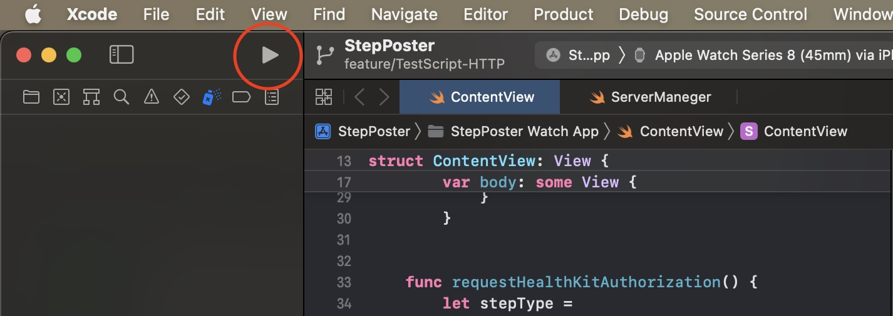

# PJ-PLATEAU_Award HTTP版デモ

## 環境要件
本プロジェクトは以下の言語、パッケージを必要とし、下記記載のOSで動作を保証します。
* マシン/OS : Intel Mac / MacOS Ventura 13.3.1
* 言語環境
    * Python 3.11以上
    * Unity 2021.3.25f1
    * Xcode Ver 14.3

## 環境構築編
本プロジェクトでは、以下の3つの環境で動作するため、clone or ダウンロード後は以下の手順で、それぞれ環境構築が必要です。
 
### 【Webサーバ】
 本デモのWebサーバは`FastAPI`で動作します.
 通常の`pip`による環境構築は以下の手順です。
### 1. 仮想環境の用意

 プロジェクトルートから、以下のディレクトリに移動し、仮想環境を構築します。
 ```bash
 cd WebServer
 ```
 その後、`venv`による仮想環境構築を実行します。
 ```bash
 python -m venv .venv
 ```
 仮想環境をアクティベートします。
 ```bash
 source venv/bin/activate

 after activate ...
 (.venv) $ <- この様にプロンプトの先頭に(.venv)が付き仮想環境が有効になっていることを確認します。
 ```

### 2. `pip install`の実行
 依存関係をインストールします。
 ```bash
pip install -r requirements.txt
```

### 【Xcode側】
XcodeがインストールされているMacであればXcode側で追加のインストール等は必要ありません。

### 【Unity側】
UnityがインストールされているMacであればUnity側で追加のインストール等は必要ありません。

## デモ起動編

### 1.【Webサーバ】Webサーバを起動する。
1. プロジェクトのルートから、以下のコマンドで`WebServer`ディレクトリに遷移します。
```bash
cd WebServer
```
2. 以下のコマンドを実行し、`FastAPI`サーバを起動します。
```bash
python ./webserver/main.py
```
以下のような表示がでれば完了です。


### 2. 【AppleWatch】WatchApp側シミュレータの起動
1. Xcodeで以下のプロジェクトを読み込みます。
```
./StepPoster/StepPoster.xcodeproj
```
2. 起動後、下記画像の赤丸部分をクリックし、アプリケーションのビルドと実行を行います。


###  3. 【Unity側】クライアントの実行
1. Unity Hubより以下のプロジェクトを読み込んでください。
```
./PLATEAU-run Client
```
2. デモ用シーンは以下のディレクトりにあります。Unity側から選択して読み込んでください。
```
Assets/Scenes/SampleScene
```
3. シーンを読み込んだら、いつも通り実行ボタン（▶）を押してください。

以上でデモを実行する事ができます。